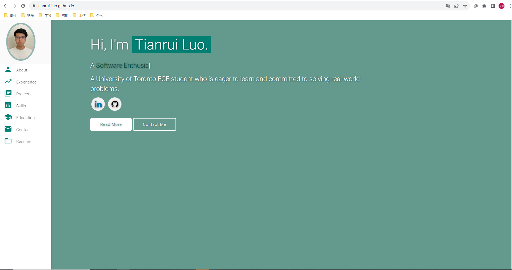
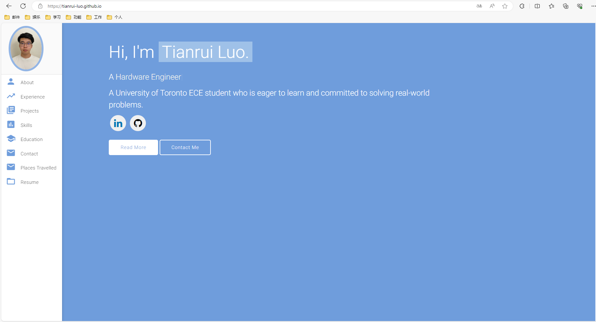
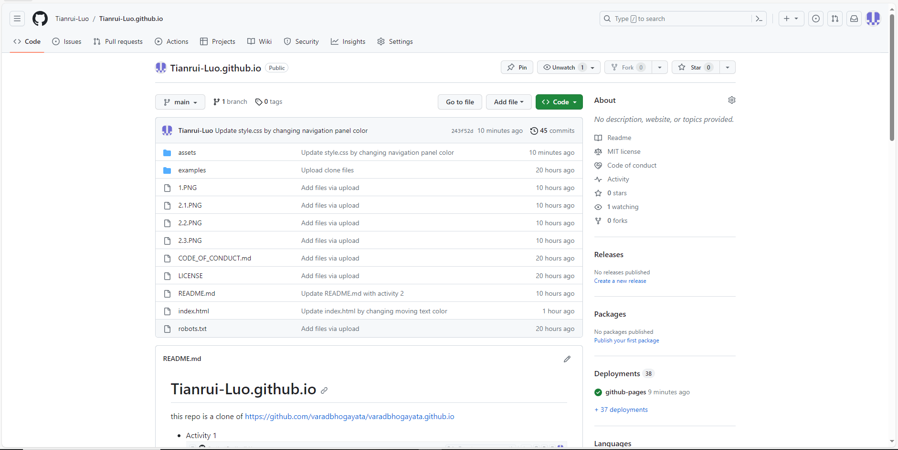
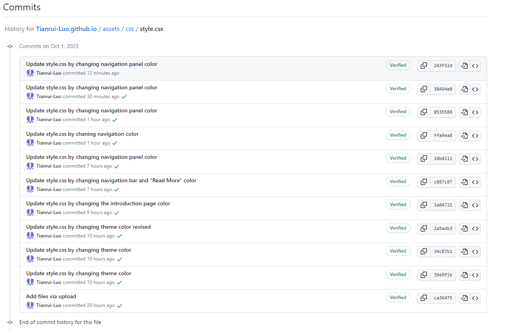
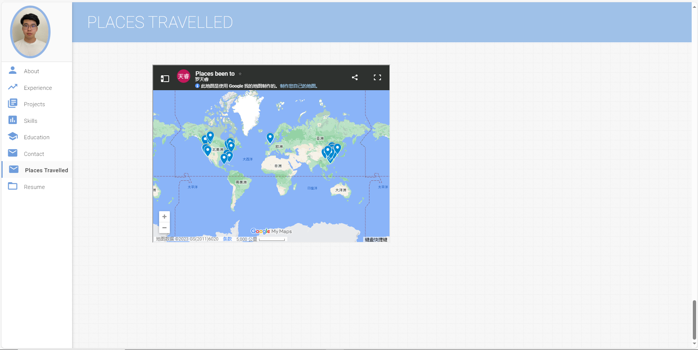
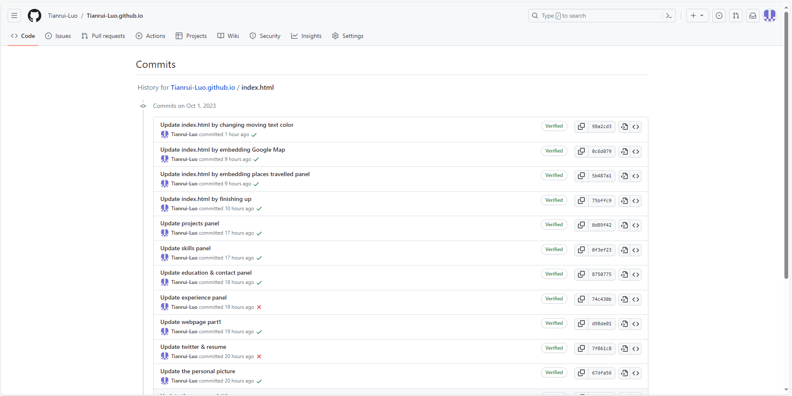

# Tianrui-Luo.github.io
this repo is a clone of https://github.com/varadbhogayata/varadbhogayata.github.io

* Activity 1

* Activity 2

Updated personal webpage screenshot

Updated Github Repo homepage

Commit history of index.html file

* Activity 3

Updated personal webpage with preferred color screenshot

Updated Github Repo homepage

Commit history of style.css file

* Activity 4

Updated personal webpage with "Places travelled" panel screenshot

Updated Github Repo homepage(The repo homepage looks the same to the repo in activity 3, since I found a glitch on activity 3 after I've done activity 4. I forgot to take a screenshot at the time of finishing activity 4, and this is the screenshot after I fixed the glitch in activity 3.)

Commit history of index.html file

